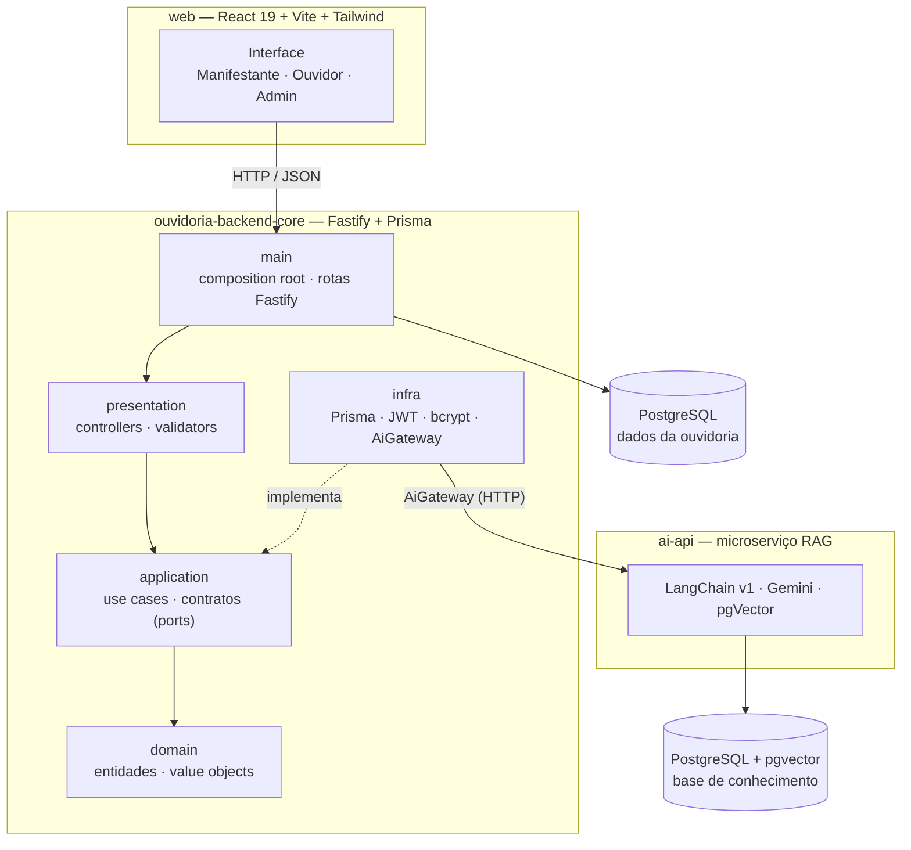

<div align="center">

# Ouvidoria UESPI

### Sistema de Ouvidoria Institucional da Universidade Estadual do Piauí

_Plataforma para registro, encaminhamento e acompanhamento de manifestações (denúncias, reclamações, sugestões e elogios), com um assistente virtual — o **Guará** — que orienta o cidadão e ajuda a montar o rascunho da manifestação._


</div>

---

## Sumário

- [Ouvidoria UESPI](#ouvidoria-uespi)
  - [Sistema de Ouvidoria Institucional da Universidade Estadual do Piauí](#sistema-de-ouvidoria-institucional-da-universidade-estadual-do-piauí)
  - [Sumário](#sumário)
  - [Sobre o projeto](#sobre-o-projeto)
  - [Funcionalidades](#funcionalidades)
  - [Arquitetura](#arquitetura)
    - [Backend — Clean Architecture](#backend--clean-architecture)
    - [Trilha de auditoria sem tabela de auditoria](#trilha-de-auditoria-sem-tabela-de-auditoria)
    - [Microserviço de IA (`ai-api`)](#microserviço-de-ia-ai-api)
  - [Stack utilizada](#stack-utilizada)
    - [Backend (`ouvidoria-backend-core`)](#backend-ouvidoria-backend-core)
    - [Microserviço de IA (`@ouvidoria/ai-api`)](#microserviço-de-ia-ouvidoriaai-api)
    - [Frontend (`web`)](#frontend-web)
  - [Padrões de projeto](#padrões-de-projeto)
  - [Estrutura de pastas](#estrutura-de-pastas)
  - [Pré-requisitos](#pré-requisitos)
  - [Passo a passo de instalação e execução](#passo-a-passo-de-instalação-e-execução)
    - [A) Subir a stack completa via Docker](#a-subir-a-stack-completa-via-docker)
    - [B) Desenvolvimento local (hot-reload)](#b-desenvolvimento-local-hot-reload)
  - [Segurança](#segurança)
  - [Variáveis de ambiente](#variáveis-de-ambiente)
  - [Comandos úteis](#comandos-úteis)
  - [Testes e qualidade](#testes-e-qualidade)
  - [Vocabulário de domínio](#vocabulário-de-domínio)

---

## Sobre o projeto

A **Ouvidoria UESPI** é o canal oficial pelo qual a comunidade acadêmica e a sociedade comunicam demandas à universidade. Este repositório implementa a plataforma de ponta a ponta:

- um **backend** em Clean Architecture (Fastify + Prisma) que cuida de autenticação, manifestações, encaminhamento às unidades responsáveis e trilha de auditoria;
- um **frontend** em React para manifestantes, ouvidores e administradores;
- um **microserviço de IA** (`ai-api`) que hospeda o assistente virtual **Guará**, capaz de responder dúvidas institucionais com base em documentos oficiais (RAG) e ajudar o usuário a preparar o rascunho de uma manifestação.

As regras de negócio são rastreáveis ao **PRD**, aos **casos de uso (Cockburn)** e às especificações em [`doc/`](./doc).

> O **Guará** é inspirado no pássaro guará, ave típica do Delta do Parnaíba, no Piauí. Seu tom é acolhedor, simples e direto.

---

## Funcionalidades

### Manifestante

- **Cadastro e autenticação** — registro de conta, login com emissão de JWT (HS256) e consulta do próprio perfil (`/me`).
- **Registro de manifestação** — abertura de denúncia, reclamação, sugestão ou elogio, com geração automática de **protocolo** e **código de acesso**.
- **Manifestação identificada ou anônima** — usuários autenticados ou não podem registrar; manifestações anônimas são acompanhadas apenas por protocolo + código de acesso.
- **Anexos** — upload de arquivos (multipart) na manifestação e download por URL assinada.
- **Acompanhamento** — listagem das próprias manifestações, detalhes com **histórico de eventos** (registro, resposta, mudança de status, finalização) e métricas pessoais.
- **Mensagens** — troca de mensagens com a ouvidoria dentro de uma manifestação aberta.
- **Encerramento e avaliação** — finalização da manifestação pelo autor e **avaliação** (nota + comentário) do atendimento.

### Acompanhamento anônimo (por protocolo)

- Consulta de manifestação por **protocolo + código de acesso**, sem login.
- Visualização de detalhes, envio de mensagens e download de anexos — tudo autenticado pelo par protocolo/código.

### Ouvidor / Administrador

- **Painel de manifestações** — listagem com filtros e **métricas agregadas** (por status, tipo, período).
- **Detalhes administrativos** — visão completa da manifestação, histórico e download de anexos.
- **Atendimento** — responder a manifestação, **alterar status** (`in_analysis` · `answered` · `canceled` · `finalized`) e **cancelar** com justificativa.
- **Encaminhamento** — direcionar a manifestação à **unidade administrativa** responsável.
- **Controle de acesso por papel** — rotas protegidas por `requireRoles` (`ombudsman`, `admin`).

### Assistente virtual (Guará)

- **Chat orientado por RAG** — responde dúvidas institucionais com base em documentos oficiais (Gemini + pgVector no `ai-api`).
- **Rascunho assistido** — detecta a intenção de manifestar e monta um **rascunho estruturado** (tipo, campus, unidade) para o usuário revisar antes de registrar.

### Catálogo

- Listagem pública de **campi** e **unidades administrativas** (com cache + TTL via `CachedCatalogRepository`) para alimentar formulários de registro e encaminhamento.

---

<div align="center">
  
  <h3>Equipe de Desenvolvimento</h3>
  <table>
    <tr>
      <td align="center">
        <a href="https://github.com/ericSilvaP">
          <br>
          <sub><b>Erick</b></sub>
        </a><br>
        FrontEnd
      </td>
      <td align="center">
        <a href="https://github.com/Fabricio-Fontenele">
          <br>
          <sub><b>Fabricio Fontenele</b></sub>
        </a><br>
        BackEnd
      </td>
      <td align="center">
        <a href="https://github.com/gaboliveira-alt">
          <br>
          <sub><b>Gabriel</b></sub>
        </a><br>
        ChatBot
      </td>
      <td align="center">
        <a href="https://github.com/Kaua-cel">
          <br>
          <sub><b>Kauã</b></sub>
        </a><br>
        FrontEnd
      </td>
    </tr>
  </table>

  <h3>Orientador</h3>
  <table>
    <tr>
      <td align="center">
        <a href="https://github.com/dariobcalcada">
          <br>
          <sub><b>Prof. Dário Brito Calçada</b></sub>
        </a><br>
        Orientador
      </td>
    </tr>
  </table>
  
</div>

---

## Arquitetura

O sistema é dividido em **três aplicações** que se comunicam apenas por contratos bem definidos:



### Backend — Clean Architecture

O fluxo de dependência aponta **sempre para dentro** (`domain` não conhece ninguém; `main` conhece todos):

```
domain → application → presentation → infra → main
```

- **`domain/`** — entidades (`Manifestation`, `User`, `ManifestationMessage`) e value objects (`Email`, `Password`, `Protocol`, `UniqueEntityId`). Puro: sem framework, banco, env ou rede. As **transições de status** vivem no agregado `Manifestation` (ex.: `recordAdministrativeAnswer()`, `transitionStatusAdministratively()`, `finalizeByAuthor()`).
- **`application/`** — casos de uso (`UseCase<Input, Output>`) e os **contratos** (interfaces) de tudo que é infraestrutural: repositórios, criptografia, token, geração de protocolo e o `AiGateway`.
- **`presentation/`** — camada HTTP agnóstica de framework (`BaseController`, `Validator<T>`); traduz entrada, chama o caso de uso e mapeia erros para semântica HTTP.
- **`infra/`** — adapters concretos: Prisma (repositórios e mappers), `bcryptjs`, JWT, geradores de protocolo, e o `HttpAiGateway`/`FakeAiGateway`.
- **`main/`** — composition root: `config/env.ts` (zod), `factories/` (wiring) e `routes/` (plugins Fastify).

### Trilha de auditoria sem tabela de auditoria

O histórico da manifestação é **reconstruído a partir das mensagens** (`manifestation_messages`): eventos como `status_changed` e `finalized_by_author` são mensagens **de sistema** cujo conteúdo é um JSON, persistidas na **mesma transação** (`$transaction`) da atualização do agregado — garantindo que o log nunca diverge do estado.

### Microserviço de IA (`ai-api`)

Pacote independente (`@ouvidoria/ai-api`) com seu próprio `package.json`, `tsconfig`, `docker-compose` (pgVector na porta 5433) e `.env`. O backend o consome **apenas** pelo contrato `AiGateway` (`src/infra/ai/http-ai-gateway.ts`) — não importa nada do `ai-api` em runtime. A escolha entre o `FakeAiGateway` (em processo) e o `HttpAiGateway` (real) é feita pela env `AI_GATEWAY_PROVIDER`.

O **pipeline RAG**: documentos oficiais em `ai-api/docs/knowledge-base/` → _chunking_ ciente de cabeçalhos → embeddings (Gemini) → pgVector → recuperação por similaridade → montagem de prompt → resposta estruturada validada por zod.

---

## Stack utilizada

### Backend (`ouvidoria-backend-core`)

| Categoria           | Tecnologia                                                                               |
| ------------------- | ---------------------------------------------------------------------------------------- |
| Runtime / linguagem | Node.js 22 · TypeScript (ESM `NodeNext`)                                                 |
| Gerenciador         | pnpm 10 (workspace)                                                                      |
| HTTP                | Fastify 5 (`@fastify/jwt`, `@fastify/cors`, `@fastify/rate-limit`, `@fastify/multipart`) |
| Banco / ORM         | PostgreSQL · Prisma 7 (`@prisma/adapter-pg`)                                             |
| Validação           | Zod 4                                                                                    |
| Auth / cripto       | `jsonwebtoken` (HS256) · `bcryptjs`                                                      |
| Testes / qualidade  | Vitest · ESLint (strict + type-checked) · Prettier                                       |

### Microserviço de IA (`@ouvidoria/ai-api`)

| Categoria | Tecnologia                                                                     |
| --------- | ------------------------------------------------------------------------------ |
| HTTP      | Fastify 5 · `@fastify/helmet`                                                  |
| IA / RAG  | LangChain v1 (`@langchain/community`, `core`, `google-genai`, `textsplitters`) |
| Modelo    | Google Gemini (chat + embeddings)                                              |
| Vetores   | PostgreSQL + `pgvector`                                                        |

### Frontend (`web`)

| Categoria   | Tecnologia                                    |
| ----------- | --------------------------------------------- |
| UI          | React 19 · Vite                               |
| Estilo      | Tailwind CSS 4                                |
| Formulários | React Hook Form + `@hookform/resolvers` + Zod |
| Testes      | Vitest                                        |

---

## Padrões de projeto

| Padrão                                    | Onde aparece                                                                                                   |
| ----------------------------------------- | -------------------------------------------------------------------------------------------------------------- |
| **Clean Architecture / Ports & Adapters** | Separação `domain → application → presentation → infra → main`; contratos na aplicação, adapters na infra      |
| **Use Case**                              | Toda regra de negócio implementa `UseCase<Input, Output>` com um único `execute()`                             |
| **Repository**                            | `ManifestationsRepository`, `UsersRepository`, `CatalogRepository`… (interfaces na aplicação, Prisma na infra) |
| **Gateway**                               | `AiGateway` isola o microserviço de IA do backend                                                              |
| **Strategy (via env)**                    | `FakeAiGateway` × `HttpAiGateway` selecionados por `AI_GATEWAY_PROVIDER`                                       |
| **Decorator**                             | `CachedCatalogRepository` envolve o repositório de catálogo com cache + TTL                                    |
| **Composition Root / Factory**            | `src/main/factories/*` montam casos de uso + validadores + adapters                                            |
| **Aggregate Root**                        | `Manifestation` concentra invariantes e transições de status                                                   |
| **Value Object**                          | `Email`, `Password`, `Protocol`, `UniqueEntityId`                                                              |
| **DTO**                                   | DTOs de leitura (query-side) na aplicação                                                                      |
| **RAG (Retrieval-Augmented Generation)**  | Pipeline de ingestão + recuperação no `ai-api`                                                                 |

---

## Estrutura de pastas

```
projeto-ouvidoria/
├── src/                      # Backend (ouvidoria-backend-core)
│   ├── domain/               # entidades + value objects (puro)
│   ├── application/          # casos de uso + contratos (ports)
│   ├── presentation/         # controllers + validators (agnóstico de framework)
│   ├── infra/                # Prisma, JWT, bcrypt, AiGateway…
│   └── main/                 # composition root + rotas Fastify
├── prisma/                   # schema, migrations e seed
├── test/                     # testes (unit/ e e2e/) espelhando src/
├── ai-api/                   # microserviço de IA (RAG + Gemini)
│   ├── src/                  # mesma estrutura em camadas
│   └── docs/knowledge-base/  # documentos oficiais ingeridos (RAG)
├── web/                      # frontend React + Vite + Tailwind
├── doc/                      # PRD, casos de uso (Cockburn), specs, planos
├── docker-compose.yml        # stack completa (2 Postgres + ai-api + backend + web)
└── README.md
```

---

## Pré-requisitos

- **Node.js 22** (`>=22 <23`)
- **pnpm 10** (`npm i -g pnpm`)
- **Docker** + Docker Compose (para os bancos PostgreSQL)
- Uma **chave da API do Google Gemini** (Google AI Studio) — necessária para o `ai-api`

---

## Passo a passo de instalação e execução

> Há dois caminhos: **(A) tudo via Docker** (mais rápido para ver rodando) e **(B) desenvolvimento local** (hot-reload em cada serviço). Comece clonando o repositório.

```bash
git clone https://github.com/Fabricio-Fontenele/Ouvidoria-UESPI.git
cd Ouvidoria-UESPI
pnpm install      # backend + ai-api
```

### A) Subir a stack completa via Docker

```bash
# 1. Configure os arquivos de ambiente (veja a seção "Variáveis de ambiente")
cp .env.example .env                 # backend
cp ai-api/.env.sample ai-api/.env    # ai-api

# Ajuste no mínimo:
# - .env: JWT_SECRET, Supabase e AI_SERVICE_API_KEY
# - ai-api/.env: GOOGLE_API_KEY e AI_API_KEY
# AI_SERVICE_API_KEY deve ser igual ao AI_API_KEY.

# 2. Suba tudo (2 Postgres + ai-api + backend + web)
docker compose up -d --build

# 3. Ingerir a base de conhecimento do Guará (o índice começa VAZIO)
docker compose exec ai-api pnpm ingest:reset

# 4. Verifique a saúde
curl localhost:3333/health     # backend  -> {"status":"ok"}
curl localhost:4000/ready      # ai-api   -> hasIndexedChunks:true
```

Acesse o frontend em **http://localhost:5173**.

### B) Desenvolvimento local (hot-reload)

```bash
# 1. Configure os arquivos de ambiente
cp .env.example .env
cp ai-api/.env.sample ai-api/.env
cp web/.env.example web/.env

# Ajuste no mínimo:
# - .env: JWT_SECRET e Supabase
# - ai-api/.env: GOOGLE_API_KEY
# - web/.env: VITE_API_BASE_URL=http://localhost:3333
#
# Se quiser usar o Guará real no backend local, configure também:
# - .env: AI_GATEWAY_PROVIDER=http, AI_SERVICE_BASE_URL=http://localhost:4000 e AI_SERVICE_API_KEY
# - ai-api/.env: AI_API_KEY igual ao AI_SERVICE_API_KEY

# 2. Instale as dependências do frontend, que é um app npm fora do workspace pnpm
(cd web && npm install)

# 3. Suba apenas os bancos
pnpm db:up                                   # Postgres do backend (porta 5432)
pnpm --filter @ouvidoria/ai-api db:up        # pgVector do ai-api  (porta 5433)

# 4. Backend: aplique migrations + seed
pnpm prisma migrate deploy
pnpm db:seed

# 5. ai-api: ingerir a base de conhecimento (chamadas reais de embedding)
pnpm --filter @ouvidoria/ai-api ingest:reset

# 6. Rode os três serviços (terminais separados)
pnpm --filter @ouvidoria/ai-api dev          # ai-api  -> :4000
pnpm dev                                     # backend -> :3333
(cd web && npm run dev)                      # web     -> :5173
```

> O backend usa a flag `--env-file` do Node 22 para carregar o `.env` **antes** de qualquer `import`, evitando a corrida de carregamento do Prisma (`DATABASE_URL must be set...`).

---

## Segurança

O backend valida a configuração na inicialização (`src/main/config/env.ts`) e falha rápido quando uma variável obrigatória ou condicional está ausente.

- **JWT** — tokens HS256 assinados com `JWT_SECRET`; use um segredo forte com pelo menos 32 caracteres.
- **Senhas** — hash via `bcryptjs`; o custo é configurado por `PASSWORD_HASH_ROUNDS`.
- **CORS** — em desenvolvimento permite a origem informada ou qualquer origem; em produção exige `CORS_ORIGIN`.
- **Headers e abuso** — Fastify registra `@fastify/helmet` e `@fastify/rate-limit` (120 req/min nas rotas que usam rate limit).
- **Anexos** — arquivos ficam no Supabase Storage e downloads são feitos por URL assinada com expiração configurável.
- **E-mail transacional** — por padrão usa provider `console`; para envio real use Brevo e configure as credenciais obrigatórias.
- **IA** — o backend pode usar `FakeAiGateway` local ou chamar o `ai-api` por HTTP com chave compartilhada.

---

## Variáveis de ambiente

Copie `.env.example` para `.env` e ajuste os valores sensíveis antes de subir a aplicação.

```bash
cp .env.example .env
```

**Backend (`.env`)** — variáveis lidas pela aplicação:

| Variável                                     | Descrição                                                                                       |
| -------------------------------------------- | ----------------------------------------------------------------------------------------------- |
| `NODE_ENV`                                   | ambiente (`development`, `test` ou `production`); padrão `development`                          |
| `HOST` / `PORT`                              | host e porta do servidor HTTP; padrões `0.0.0.0` e `3333`                                       |
| `CORS_ORIGIN`                                | origem pública do frontend; **obrigatória em produção**                                         |
| `DATABASE_URL`                               | conexão do Postgres principal                                                                   |
| `JWT_SECRET`                                 | segredo HS256 dos tokens; mínimo de 32 caracteres                                               |
| `JWT_EXPIRES_IN_SECONDS`                     | duração do token JWT; padrão 8h                                                                 |
| `PASSWORD_HASH_ROUNDS`                       | custo do bcrypt; permitido entre 4 e 15, padrão 10                                              |
| `SUPABASE_URL`                               | URL do projeto Supabase                                                                         |
| `SUPABASE_SERVICE_ROLE_KEY`                  | service role key usada pelo backend para gravar e assinar anexos                                |
| `SUPABASE_STORAGE_BUCKET`                    | bucket dos anexos, ex.: `manifestation-attachments`                                             |
| `SUPABASE_SIGNED_URL_EXPIRES_IN_SECONDS`     | expiração das URLs assinadas de download; padrão 300                                            |
| `EMAIL_PROVIDER`                             | `console` (logs locais) ou `brevo` (envio real)                                                 |
| `BREVO_API_KEY` / `EMAIL_FROM`               | obrigatórias quando `EMAIL_PROVIDER=brevo`; `EMAIL_FROM` precisa ser remetente verificado       |
| `EMAIL_FROM_NAME`                            | nome exibido no remetente; padrão `Ouvidoria UESPI`                                             |
| `AI_GATEWAY_PROVIDER`                        | `fake` (sem serviço externo) ou `http` (usa o `ai-api`)                                         |
| `AI_SERVICE_BASE_URL` / `AI_SERVICE_API_KEY` | obrigatórias quando `AI_GATEWAY_PROVIDER=http`; a chave deve bater com `AI_API_KEY` do `ai-api` |
| `AI_SERVICE_TIMEOUT_MS`                      | timeout das chamadas ao `ai-api`; padrão 30000                                                  |
| `AI_HISTORY_MAX_CHARS`                       | limite do histórico enviado ao assistente; padrão 12000                                         |
| `CATALOG_CACHE_TTL_MS`                       | TTL do cache de catálogo de campi/unidades; padrão 300000                                       |

**Variáveis auxiliares no `.env.example`** — usadas por Docker/deploy, não pela aplicação backend:

| Variável               | Uso                                                                                                 |
| ---------------------- | --------------------------------------------------------------------------------------------------- |
| `POSTGRES_PASSWORD`    | interpolação do `docker-compose.yml`; deve bater com a senha de `DATABASE_URL`                      |
| `AI_POSTGRES_PASSWORD` | senha do Postgres do `ai-api` no Compose; deve bater com a senha interpolada no `DATABASE_URL` dele |
| `VITE_API_BASE_URL`    | embutida no build do frontend pelo Vite e validada por `scripts/deploy.sh` em produção              |

**`ai-api/.env`** — destaques:

| Variável                                             | Descrição                                               |
| ---------------------------------------------------- | ------------------------------------------------------- |
| `GOOGLE_API_KEY`                                     | chave do Google Gemini                                  |
| `GOOGLE_CHAT_MODEL`                                  | modelo de chat (recomendado: `models/gemini-2.5-flash`) |
| `GOOGLE_EMBEDDING_MODEL` / `GOOGLE_EMBEDDING_DIMS`   | modelo e dimensões dos embeddings                       |
| `AI_API_KEY`                                         | chave compartilhada com o backend                       |
| `RAG_TOP_K` / `RAG_CHUNK_SIZE` / `RAG_CHUNK_OVERLAP` | parâmetros do RAG                                       |

> Os arquivos `.env` **não** são versionados. Use `.env.example`, `ai-api/.env.sample` e `web/.env.example` como base.

---

## Comandos úteis

**Backend (raiz):**

```bash
pnpm dev              # servidor com hot-reload
pnpm build            # compila para build/
pnpm test             # testes unitários (Vitest)
pnpm test:e2e         # testes e2e (requer Postgres via pnpm db:up)
pnpm check            # gate completo: format + lint + type-check + unit
pnpm db:up / db:down  # Postgres via Docker
pnpm db:seed          # popula catálogo (campi/unidades) e usuários demo
```

**ai-api:**

```bash
pnpm --filter @ouvidoria/ai-api dev            # servidor :4000
pnpm --filter @ouvidoria/ai-api ingest:reset   # reconstrói o índice vetorial
pnpm --filter @ouvidoria/ai-api test           # testes
```

**web:**

```bash
(cd web && npm run dev)     # Vite dev server :5173
(cd web && npm run build)   # build de produção
```

---

## Testes e qualidade

- **Unitários** (`test/unit/`) espelham a árvore de produção; mock via `vitest-mock-extended` contra os **contratos** — sem banco/HTTP/cripto reais.
- **E2E** (`test/e2e/`) rodam contra um Postgres real, cada spec em um schema isolado (`e2e_<uuid>`).
- **Gate local** antes de abrir PR:

```bash
pnpm check
```

A tipagem é **estrita** (`exactOptionalPropertyTypes`, `noUncheckedIndexedAccess`, `verbatimModuleSyntax`…) e o ESLint roda o preset **strict + type-checked**.

---

## Vocabulário de domínio

Termos canônicos — usados de forma consistente em todo o código (não use `ticket`, `issue` ou `chamado`):

- **`User`** — papéis: `manifestant`, `ombudsman`, `admin`
- **`Manifestation`**, **`Protocol`**, **`Attachment`**
- **`ManifestationType`**: `report` (denúncia) · `complaint` (reclamação) · `suggestion` (sugestão) · `compliment` (elogio)
- **`ManifestationStatus`**: `in_analysis` · `answered` · `canceled` · `finalized`

---

<div align="center">

Desenvolvido por **Erick · Fabricio · Gabriel · Kauã** — orientação do Prof. **Dário Brito Calçada**
<br/>
Universidade Estadual do Piauí — UESPI

</div>
